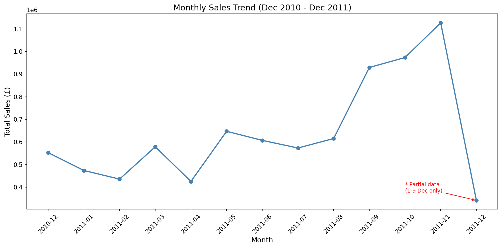
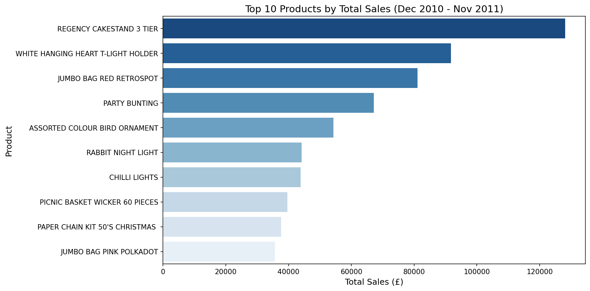
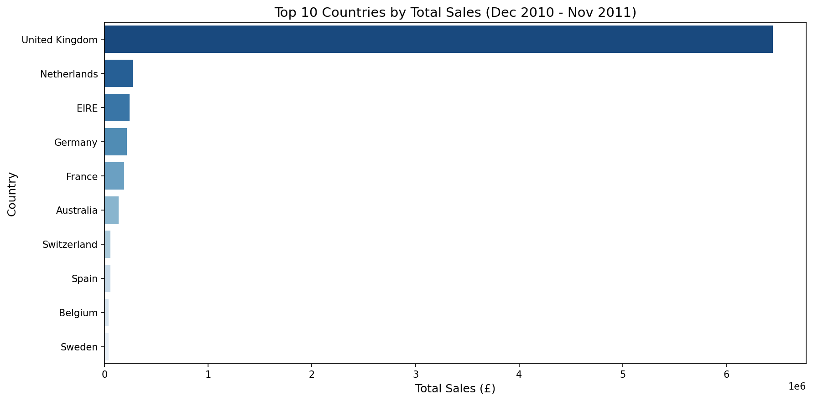
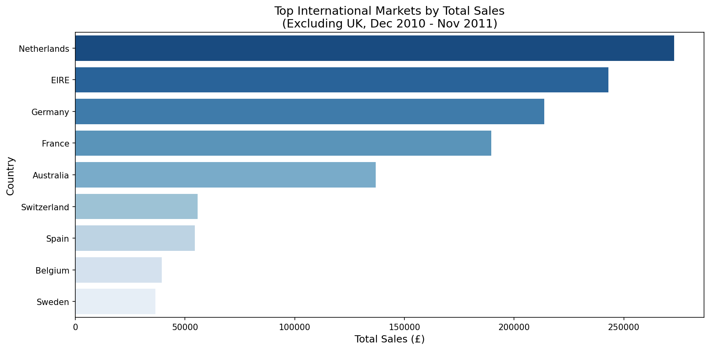

# Project 1: E-Commerce Sales Analysis

## Business Problem
The sales team reported a decline in monthly revenue. 
This analysis aims to identify the root cause and 
provide actionable recommendations.

## Analysis Approach
1. Load and understand the dataset
2. Clean and preprocess the data
3. Explore monthly sales trends
4. Identify underperforming products and regions
5. Provide business recommendations

## Tools & Skills
- Python (Pandas, Matplotlib, Seaborn)
- Jupyter Notebook
- Data Cleaning, EDA, Data Visualization

## Dataset
- Source: UCI Online Retail Dataset (via Kaggle)
https://www.kaggle.com/datasets/carrie1/ecommerce-data
- Period: Dec 2010 – Dec 2011
- Records: ~541,000 transactions

## Charts

### Monthly Sales Trend

### Top 10 Products by Total Sales

### Top 10 Countries by Total Sales

### International Markets (Excluding UK)

## Key Findings
**Sales Trend**
- Sales showed a general upward trend from Dec 2010 to Nov 2011,
  with dips in Q1 (Jan-Feb) and April, before a strong Q4 recovery
  peaking in November (£1.13M)
- December 2011 data is incomplete (1–9 Dec only) and excluded
  from trend analysis

**Pricing & Volume**
- November recorded the highest sales volume and the lowest Average
  Unit Price (£3.00), suggesting promotional pricing drove Q4 growth
- June 2011 saw the highest Average Unit Price (£4.70) but did not
  correspond to peak sales volume, indicating price increases alone
  do not drive revenue

**Top Products**
- REGENCY CAKESTAND 3 TIER was the best-selling product (£128,139),
  outperforming 2nd place by 40%
- Top products are predominantly home décor and gift items,
  indicating a clear customer preference

**Product Preference by Market**
- REGENCY CAKESTAND 3 TIER appears in top 3 across UK, EIRE,
  Germany, Switzerland and Spain, confirming its status as a hero product
- Netherlands and Belgium favour snack boxes and lunch boxes,
  suggesting a preference for practical everyday items
- France and Australia both favour RABBIT NIGHT LIGHT,
  indicating cross-market appeal for novelty lighting products

**Market Performance**
- United Kingdom dominates sales at 88% of total revenue (£6.45M)
- Netherlands, EIRE and Germany are the strongest international markets
- USA has 291 transactions but only £1,116 in revenue (Dec 2010 – Nov 2011), 
the lowest average order value among all markets

**Underperforming Areas**
- Saudi Arabia recorded the lowest sales (£131) with only 10 transactions
- Bottom products in Western Europe are mostly under £1.00,
  suggesting price alone does not drive purchase decisions
- Australia and Sweden's bottom products are priced £4-7,
  suggesting even relatively higher-priced items struggle to sell
  in these markets, possibly due to limited market penetration

## Business Recommendations
**1. Replicate Q4 Promotional Strategy in Q1**
November's success was driven by volume through lower pricing.
Recommend applying similar promotional pricing in Jan-April
to address the seasonal dip.

**2. Focus International Expansion on Europe**
Netherlands, EIRE and Germany show consistent demand.
Recommend increasing marketing budget for these three markets.

**3. Develop USA Upselling Strategy**
High transaction count (291) but low revenue suggests customers
are buying low-value items. Recommend introducing premium product
bundles targeted at US customers to increase average order value.

**4. Review Underperforming Products**
Bottom 10 products generated less than £1.25 each.
Recommend discontinuing or bundling these with popular products
to reduce inventory costs.

**5. Leverage Hero Products Globally**
REGENCY CAKESTAND 3 TIER sells well across UK, EIRE, Germany and Spain.
Recommend promoting this product in markets where it has not yet
appeared, particularly Netherlands and France.
