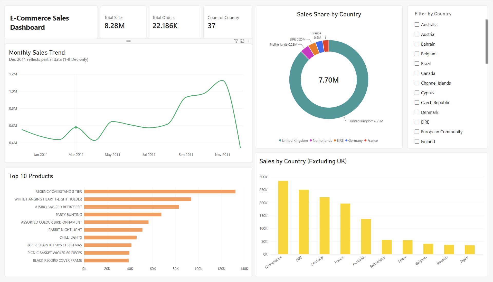

# Project 1: E-Commerce Sales Analysis

An end-to-end data analysis pipeline on the UCI Online Retail dataset,
covering data cleaning and exploratory analysis in **Python**, business
querying in **SQL**, and an interactive **Power BI** dashboard.

## Business Problem
The sales team reported a decline in monthly revenue.
This analysis aims to identify the root cause and provide actionable
recommendations.

## Analysis Approach
1. Load and understand the dataset
2. Clean and preprocess the data (Python)
3. Explore sales trends, products, and markets (Python EDA)
4. Reproduce and validate the analysis in SQL (DuckDB)
5. Build an interactive dashboard (Power BI)
6. Summarise findings and provide business recommendations

## Tools & Skills
- **Python** (Pandas, Matplotlib, Seaborn) — data cleaning, EDA, visualization
- **SQL** (DuckDB) — aggregation, filtering, window functions, CTEs
- **Power BI** — interactive dashboard with KPI cards, charts, and slicers
- **Jupyter Notebook**, Git/GitHub

## Dataset
- Source: UCI Online Retail Dataset (via Kaggle)
  https://www.kaggle.com/datasets/carrie1/ecommerce-data
- Period: Dec 2010 – Dec 2011
- Records: ~541,000 transactions (401,560 after cleaning)

> **Note:** Data files are not included in this repo due to size.
> Download the raw dataset from the Kaggle link above, then run
> `E-Commerce_Sales_Analysis.ipynb` to generate `data/data_clean.csv`
> for the SQL analysis.

## Repository Structure
```
E-Commerce-Sales-Analysis/
├── E-Commerce_Sales_Analysis.ipynb   # Python: cleaning + EDA
├── sql_analysis.ipynb                # SQL: analysis via DuckDB
├── E-Commerce_Sales_Analysis.pbix    # Power BI dashboard
├── images/                           # exported charts & dashboard
└── README.md
```

---

## 1. Python — Exploratory Data Analysis

### Monthly Sales Trend


### Top 10 Products by Total Sales


### Top 10 Countries by Total Sales


### International Markets (Excluding UK)


---

## 2. SQL — Analysis with DuckDB

The cleaned dataset is re-analysed in SQL to validate the Python findings
and demonstrate SQL proficiency. Seven queries mirror the EDA, including
window functions (`ROW_NUMBER()`) and CTEs.

| # | Query | Techniques |
|---|-------|-----------|
| 1 | Monthly Sales Trend | `GROUP BY`, date formatting |
| 2 | Top 10 Products | `WHERE`, `NOT IN`, `LIMIT` |
| 3 | Top 10 Countries | `ORDER BY DESC` |
| 4 | International Markets (Excl. UK) | multiple `WHERE` conditions |
| 5 | Top 3 Products per Country | Window function, CTE |
| 6 | Bottom 10 Countries | `ORDER BY ASC` |
| 7 | Bottom 3 Products per Country | Window function, `HAVING` |

See [`sql_analysis.ipynb`](sql_analysis.ipynb) for full queries and results.

---

## 3. Power BI — Interactive Dashboard



An interactive dashboard summarising key metrics, sales trends, top products,
and market distribution. Includes KPI cards (Total Sales, Total Orders,
Countries), a monthly trend line, a top-products bar chart, a sales-share
donut, an international-markets view, and a country slicer for filtering.

---

## Key Findings

**Sales Trend**
- Sales showed a general upward trend from Dec 2010 to Nov 2011, with dips in
  Q1 (Jan–Feb) and April, before a strong Q4 recovery peaking in November (£1.13M)
- December 2011 data is incomplete (1–9 Dec only) and excluded from trend analysis

**Pricing & Volume**
- November recorded the highest sales volume and the lowest Average Unit Price
  (£3.00), suggesting promotional pricing drove Q4 growth
- June 2011 saw the highest Average Unit Price (£4.70) but did not correspond to
  peak sales volume, indicating price increases alone do not drive revenue

**Top Products**
- REGENCY CAKESTAND 3 TIER was the best-selling product (£128,139),
  outperforming 2nd place by 40%
- Top products are predominantly home décor and gift items, indicating a clear
  customer preference

**Product Preference by Market**
- REGENCY CAKESTAND 3 TIER appears in the top 3 across UK, EIRE, Germany,
  Switzerland and Spain, confirming its status as a hero product
- Netherlands and Belgium favour snack boxes and lunch boxes, suggesting a
  preference for practical everyday items
- France and Australia both favour RABBIT NIGHT LIGHT, indicating cross-market
  appeal for novelty lighting products

**Market Performance**
- United Kingdom dominates sales at ~81% of total revenue (£6.45M)
- Netherlands, EIRE and Germany are the strongest international markets
- USA has 291 transactions but only £1,116 in revenue (Dec 2010 – Nov 2011),
  the lowest average order value among all markets

**Underperforming Areas**
- Saudi Arabia recorded the lowest sales (£131) with only 10 transactions
- Bottom products in Western Europe are mostly under £1.00, suggesting price
  alone does not drive purchase decisions
- Australia and Sweden's bottom products are priced £4–7, suggesting even
  relatively higher-priced items struggle to sell in these markets, possibly
  due to limited market penetration

## Business Recommendations

**1. Replicate Q4 Promotional Strategy in Q1**
November's success was driven by volume through lower pricing. Recommend applying
similar promotional pricing in Jan–April to address the seasonal dip.

**2. Focus International Expansion on Europe**
Netherlands, EIRE and Germany show consistent demand. Recommend increasing
marketing budget for these three markets.

**3. Develop USA Upselling Strategy**
High transaction count (291) but low revenue suggests customers are buying
low-value items. Recommend introducing premium product bundles targeted at US
customers to increase average order value.

**4. Review Underperforming Products**
Bottom 10 products generated less than £1.25 each. Recommend discontinuing or
bundling these with popular products to reduce inventory costs.

**5. Leverage Hero Products Globally**
REGENCY CAKESTAND 3 TIER sells well across UK, EIRE, Germany and Spain.
Recommend promoting this product in markets where it has not yet appeared,
particularly Netherlands and France.
